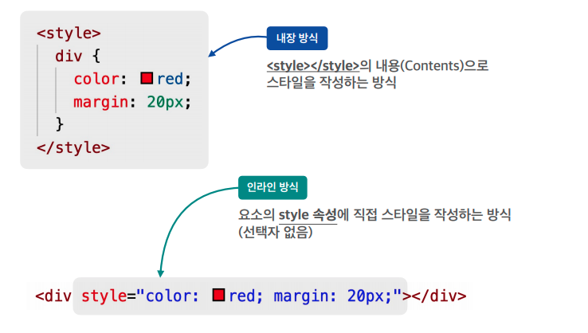
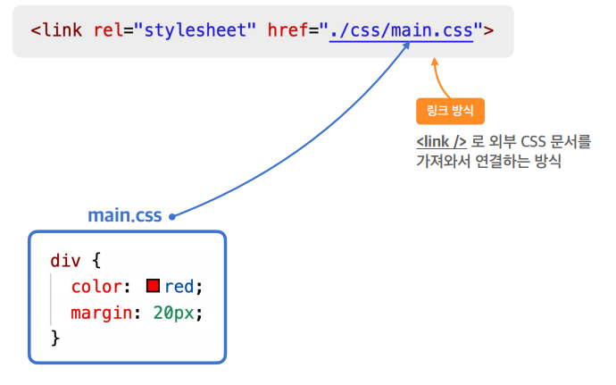
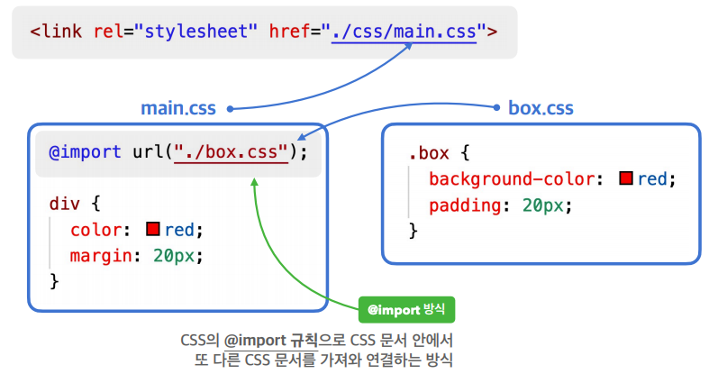
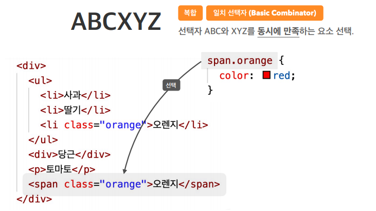
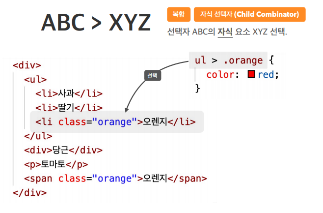
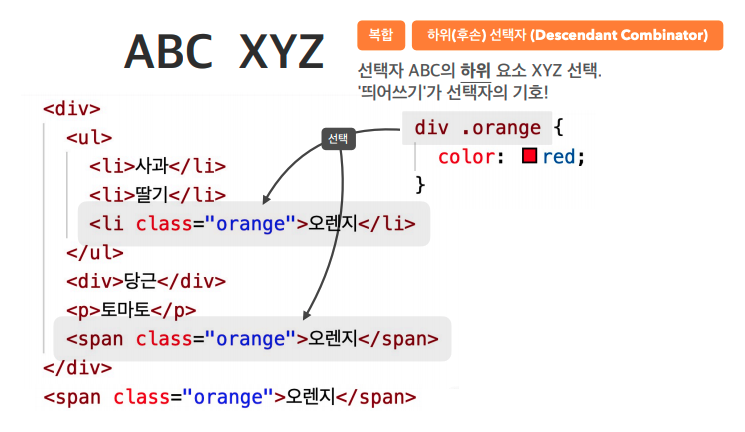
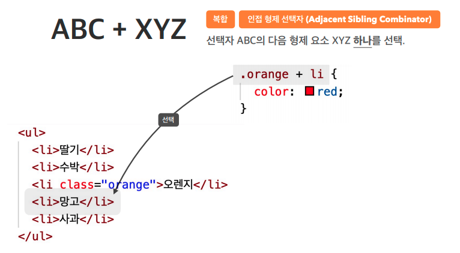
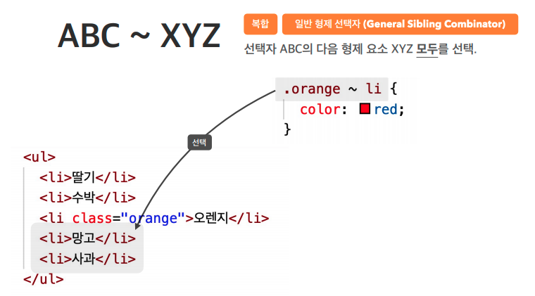

#### CSS표기 
> 선택자{속성 : 값;}

#### CSS 선언 방식
>
>
>- 주로 Link 방식 사용  
>
>
>- @import방식은 css적용이 지연될 수 있어서 잘 쓰이지 않는다.

#### CSS 선택자
>1.기본 선택자
>> 1)전체 선택자  
>>\* {} : 모든 요소를 선택
>
>>2)태그 선택자  
><태그> {} : 해당 태그를 선택
>
>>3)클래스 선택자  
>>.class명 {} : 해당 class를 선택
>
>>4)아이디 선택자  
> #id명{} : 해당 id를 선택
>

>2.복합 선택자  
>- 1)일치 선택자  
>    태그.class명{} : 해당 태그와 class명을 만족하는 요소 선택
>   
>- 2)자식 선택자  
>   태그 > .클래스명{} : 해당 태그의 자식중에 해당되는 class명을 가진 요소 선택
>   
>- 3)하위(후손) 선택자  
>   태그(공백).class명{} : 해당 태그의 후손중에 해당 class명을 가진 요소 선택 
>   
>- 4)인접 형제 선택자  
>   .class명 + 태그{}
>   
>- 5)일반 형제 선태자  
>   .class명 ~ 태그{}
>   

### <a href="https://github.com/Jiyong95/Frontend-/blob/main/part7/README2.md"> + CSS 가상 클래스 선택자</a>

#### 출처
- 패스트캠퍼스(HEROPY님 강의)
