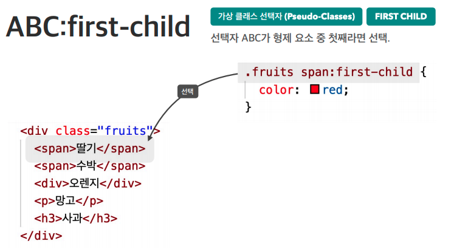
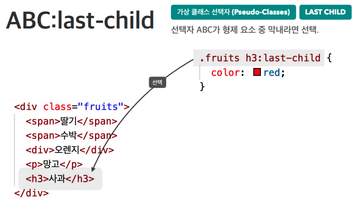
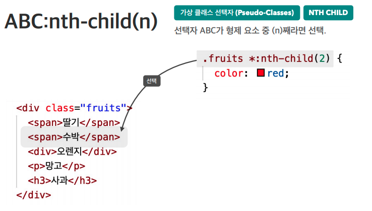
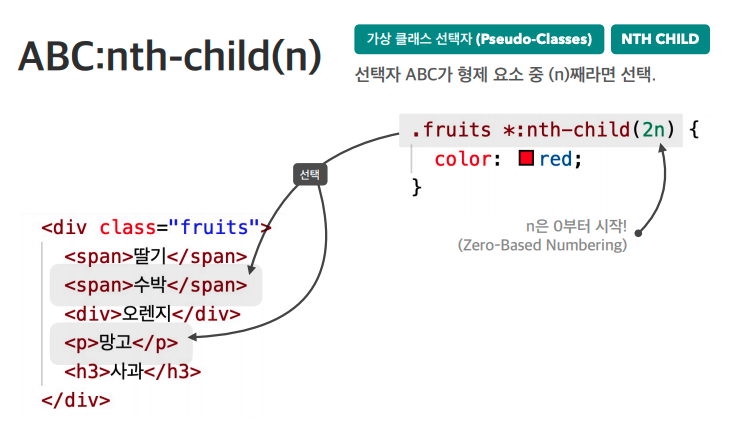
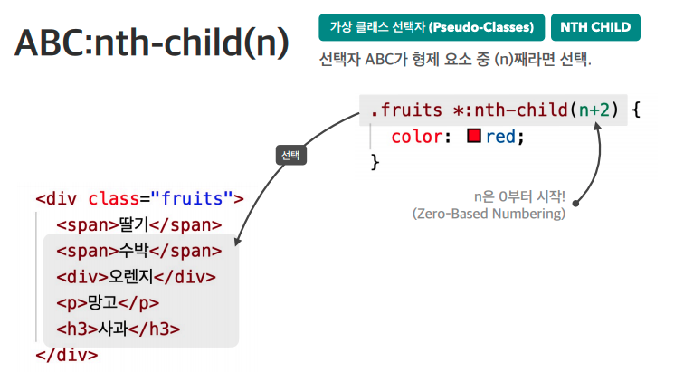
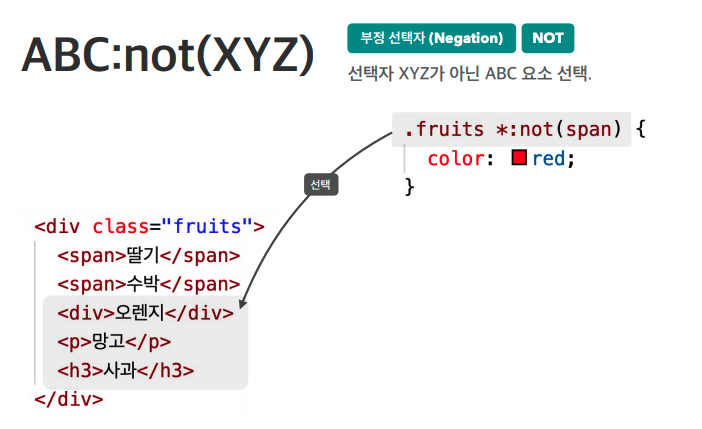

### 가상 클래스 선택자
>#### 1) :hover{}
>해당 요소에 마우스를 올리면 적용 됨
>
>#### 2) :active{}
> 해당 요소를 클릭하는 동안 적용 됨
>
>#### 3) :focus{}
> 해당 요소를 클릭(focus)하면 적용 됨  
>-  focus가 가능한 요소에 한정(ex.input, select, textarea)
>- 가능하지 않는 요소에 focus적용하기 위해선 tabindex="-1" 속성, 값을 넣어주면 가능
>#### 4) :First-child{}
>
>#### 5) :Last-child{}
>
>#### 6) :nth-child{}
>- n번째 선택
>
>- 짝수선택
>
>- 2번째부터 선택
>
>#### 7) :not(){}
>

#### 출처
- 패스트캠퍼스(HEROPY님 강의)
