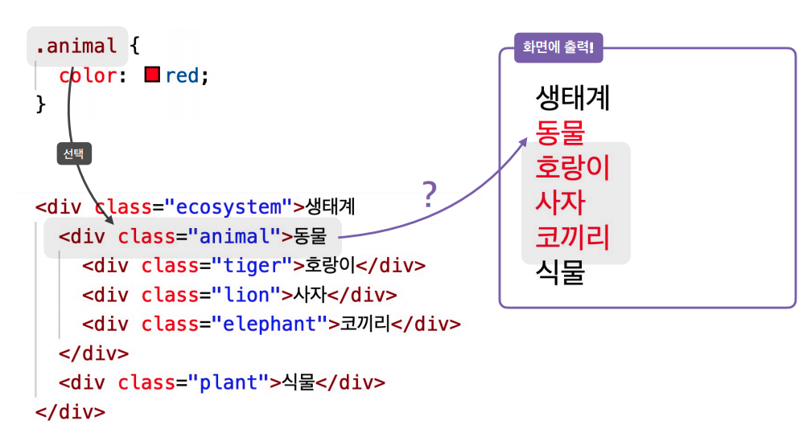
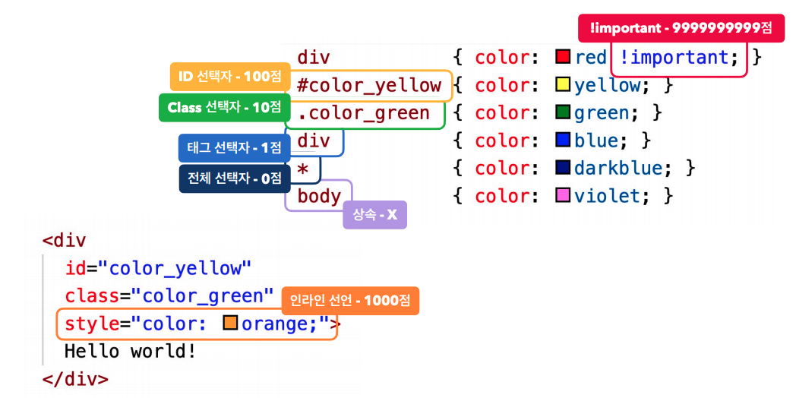
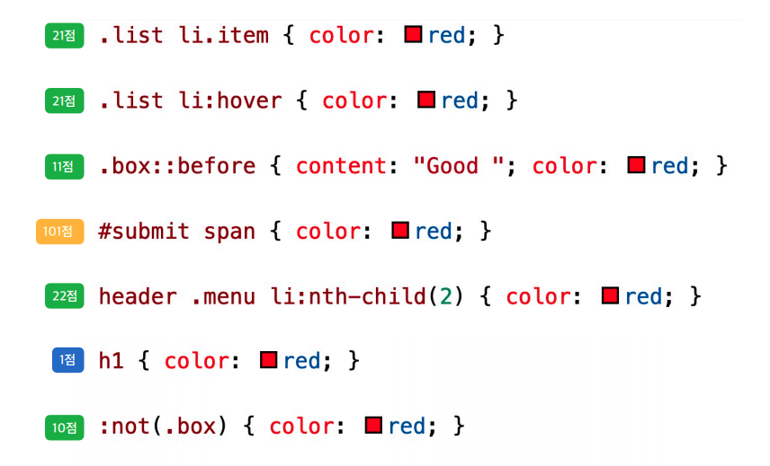

### CSS 상속
> 
> #### 특징
> - 모든 속성이 상속되는 건 아님 (ex. height)  
> - 상속이 안되는 속성을 상속하고 싶을 때(inherit)  
>   - ex) height : inherit;

### 선택자 우선순위
> 1.우선 순위가 높은 선택자가 우위  
> 2.우선 순위가 같으면 선언 순서에 따라(후 선언이 유리)  
>   
>   

