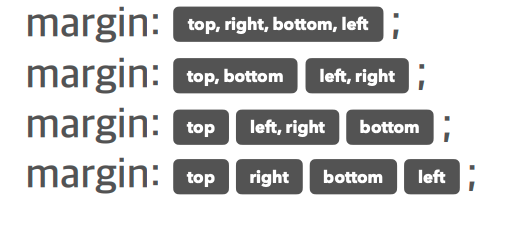
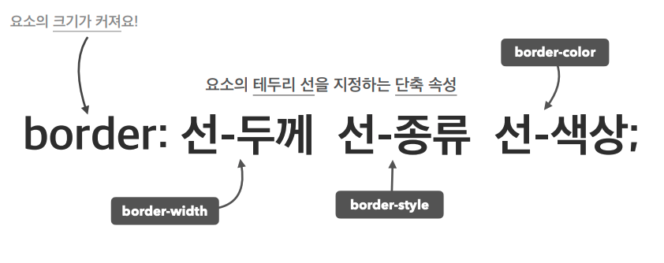
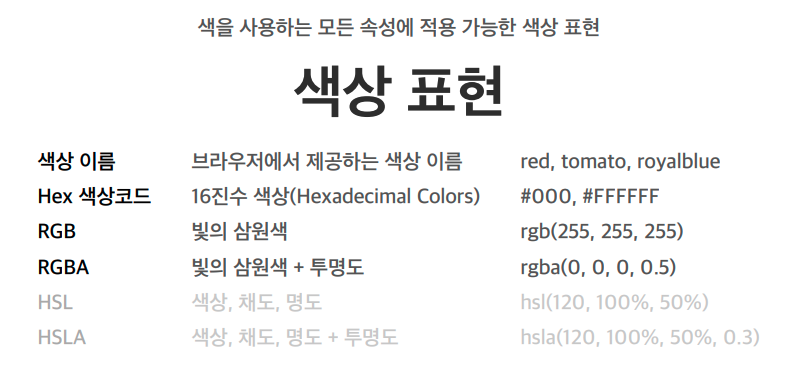
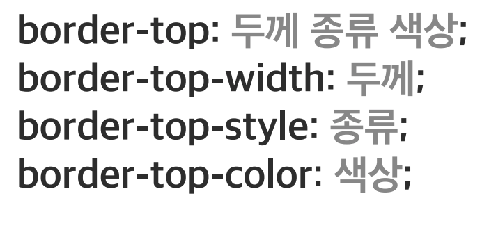
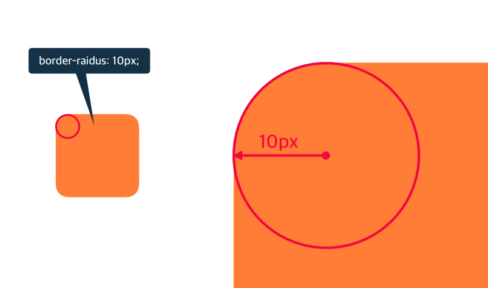
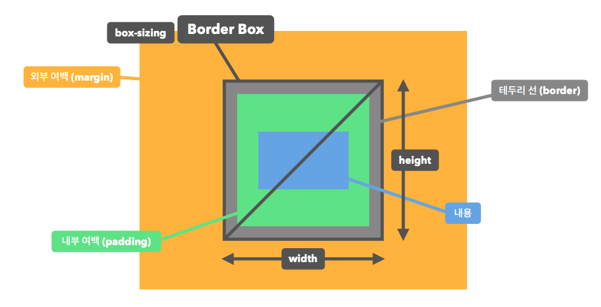
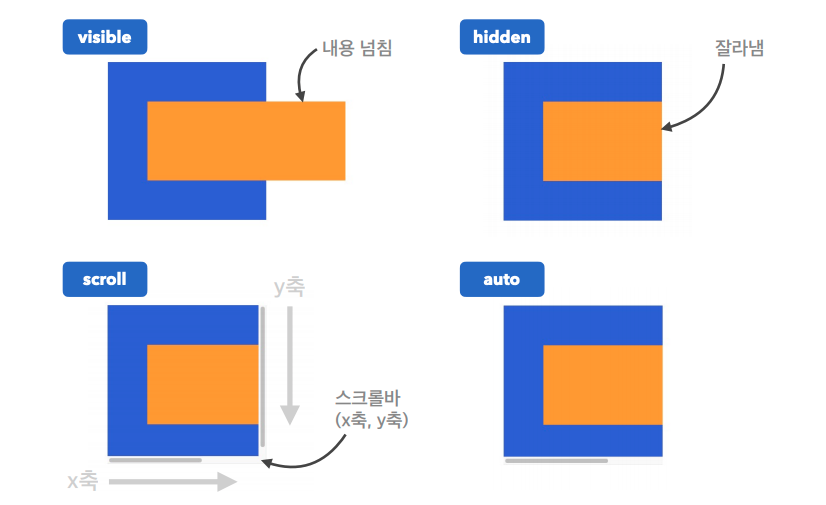
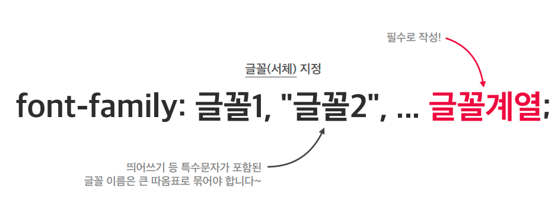
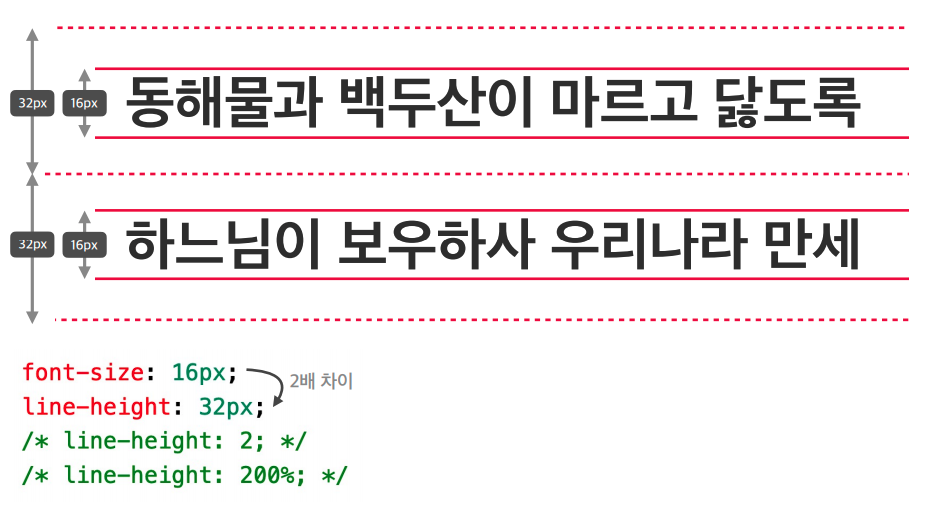

## CSS 단위
|단위|설명|
|---|---|
|px|픽셀|
|%|상대적 백분율|
|em|포함된 요소의 글꼴 크기|
|rem|루트 요소(html)의 글꼴 크기
|vw|뷰포트 가로 너비의 백분율(0~100vw)|
|vh|뷰포트 세로 너비의 백분율(0~100vh)|

### 1.width, height
>기본 값 : auto  (width : auto;)  
>단위 : px, em, vw 등  

### 2.max-width, max-height
>기본 값 : none(=제한 없음)  
>단위 : px, em, vw 등  

### 3.min-width, min-heigh
>기본 값 : 0  

### 4.margin(외부여백)
>기본 값 : 0  
>#### 단위  
>- px, em, vw ...  
>- auto (가운데 정렬)  
>#### 특징  
>- margin에 의해 요소의 크기가 커지지 않음  
>- margin 값으로 음수를 줄 경우 크기가 작아짐  
>#### 사용
>- 1)  
>- 2)margin-(top,right,left,bottom)

### 5.padding(내부여백)
>기본 값 : 0  
>#### 단위
>- px, em, vw ...
>- %(부모 요소의 width에 대한 비율로 지정)
>#### 특징
> - padding값에 의해 요소의 크기가 커짐  
>#### 사용  
> - margin과 같음

### 6.border
>#### 기본 값
>- border: medium none black;
>#### 특징
>- border에 의해 요소의 크기가 커짐
>#### 사용  
>

### 6-1.border-width
>#### 사용  
>
### 6-2.border-style
>#### 사용
>- border-width와 같음
### 6-3.border-color
>#### 사용
>- border-width와 같음
>#### 색상 표현(Color)
>

### 6-4. border-방향
>#### 사용
>

### 6-5. border-radius
>#### 개념
>
>#### 사용
>- margin, padding ...과 같음

### 7.box-sizing
>- content-box(기본 값) : 요소의 내용으로 크기 계산
>- border-box : 요소의 내용 + padding + border포함한 값 == width값
>

### 8.overflow
>요소 크기 이상일 때, 보여짐을 제어  
>#### 값  
>  - visible(기본 값) : 넘친 내용 그대로 보여짐  
>  - hidden : 넘친 내용 잘라냄  
>  - auto : 넘친 내용 잘라냄 + 스크롤바 생성(넘친 x or y축)  
>  - scroll : x, y축 스크롤바 생성(넘치지 않아도)  
>

### 8-1.overflow-방향
>x, y축 개별로도 제어할 수 있다
>- overflow-x  
>- overflow-y  

### 9.display
>요소의 보여짐을 제어
>#### 기본 값
> block, inline, inline-block : 요소의 종류에 따라 기본 값으로 지정돼 있다.
>#### 값
> - flex : 수평, 수직 정렬(1차원 레이아웃)
> - grid : 2차원 레이아웃
> - none : 화면에 출력 x
> - 등등등

### 10.opacity
> 요소 투명도  
> 값 : 0 ~ 1(기본 값)

### 11. font
>- font-size : 16px(기본 값) | px,em,rem  
>- font-weight : normal(=400 기본 값)| bold(=700),| 100~900  
>- font-style : normal(기본 값:기울기 x), italci(기울기 o)

### 12.font-family
>  
>#### 네이버
>- font-family: -apple-system,BlinkMacSystemFont,"Malgun Gothic","맑은 고딕",helvetica,"Apple SD Gothic Neo",sans-serif;
>- 순차적으로 브라우저에서 글꼴이 있으면 적용됨  
>- ""는 글꼴 명에 띄어쓰기가 있으면 사용  
>#### 글꼴 종류
>- serif(바탕체 계열)  
>- sans-serif (웹에서 거의 쓰임)  
>- monospace (글자 간격이 동일. 코드에디터에서 사용)  
>- 등등  

### 13. line-height
> 한 줄의 높이, 행간과 비슷  
>
>#### 값  
>- normal(기본 값)
>- 숫자(요소의 글꼴 크기의 배수) <= 추천하는 방법  
>   - ex)2(=200%) 둘 다 2배
>- px,em,rem  

### 14. color
> 글자의 색상  
> 기본 값 : rgb(0,0,0)  

### 15.text-align
> 글자 정렬 제어  
>#### 값  
>- left(기본 값) : 왼쪽 정렬  
>- right : 오른쪽 정렬  
>- center : 가운데 정렬  

### 16.text-decoration
>글자 장식(선)  
>#### 값  
>- none(기본 값)  
>- underline : 밑줄  
>- line-through : 중앙 선  

### 17.text-indent
>들여쓰기  
>#### 값
>- 0(기본 값)  
>- 1 ~   : 들여쓰기  
>-   ~ 0 : 내어쓰기  

## <a href="https://github.com/Jiyong95/Frontend-/blob/main/part8/README1.md">CSS 속성2</a>
