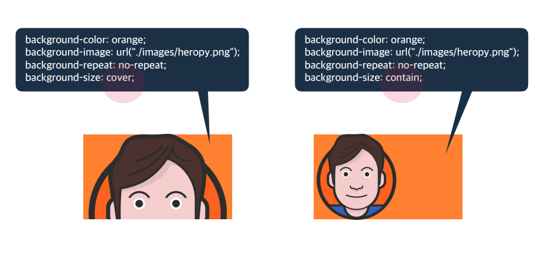
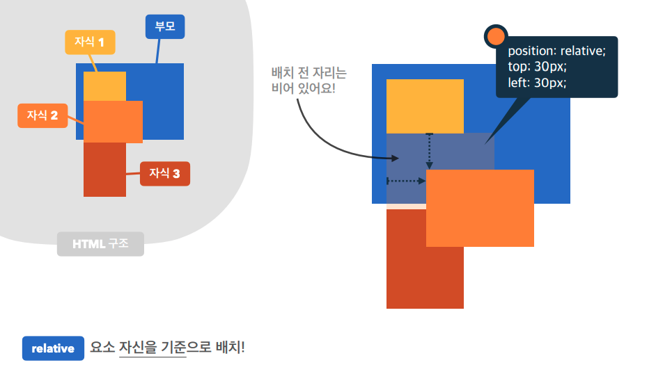
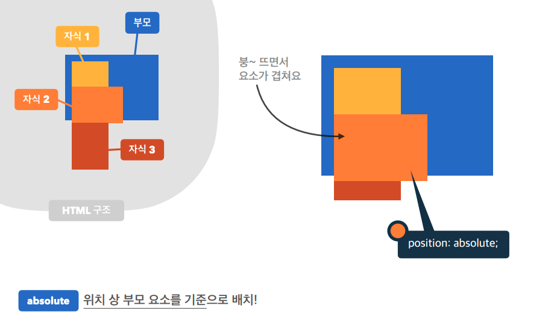
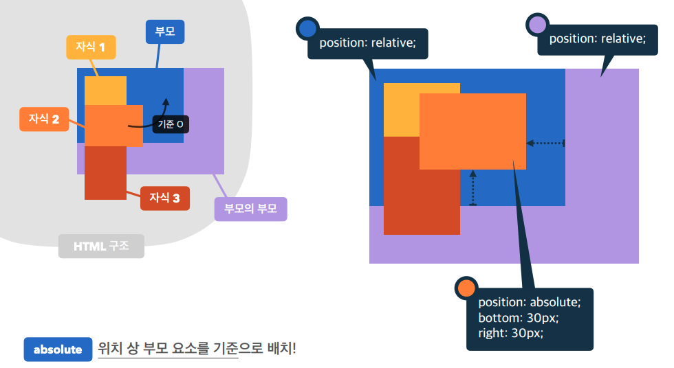
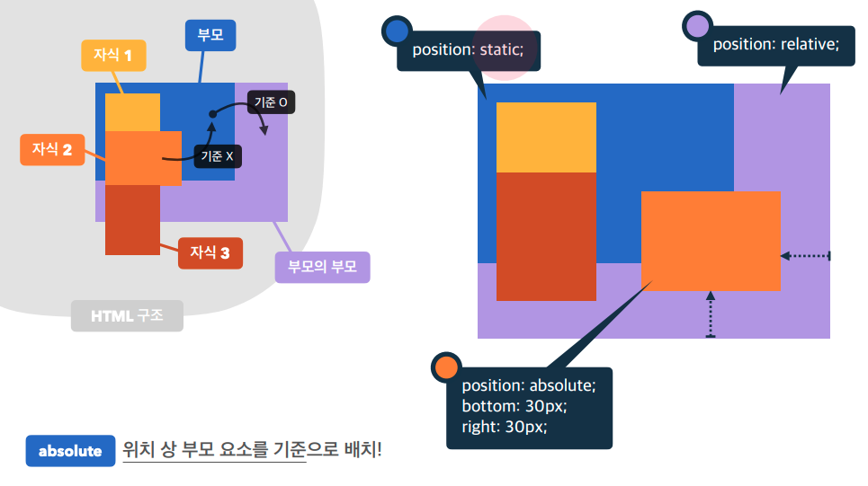
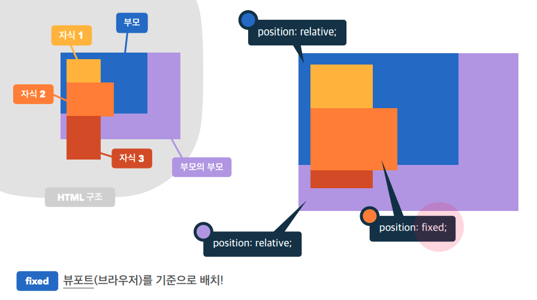
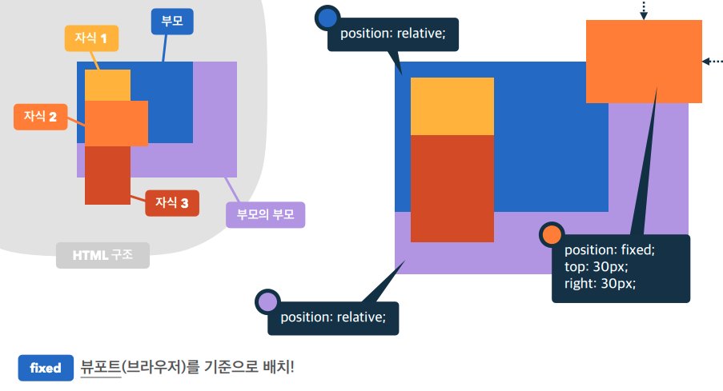
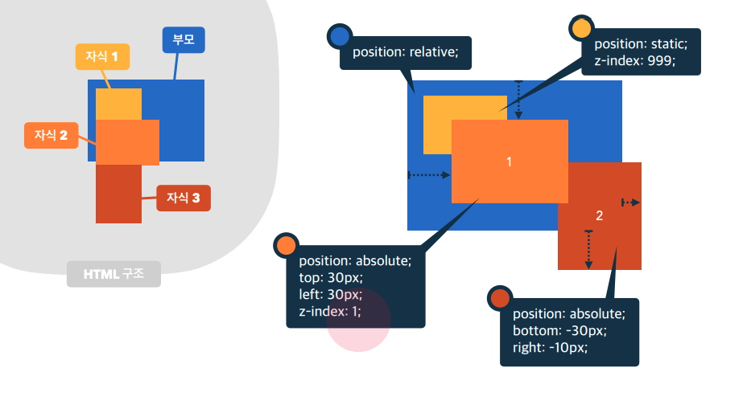

### 18-1.background-color
>요소의 배경색 추가

### 18-2.background-image
>image를 배경으로 사용  
>ex) background-image:url("경로");  

### 18-2.background-size
>배경 size 제어  
>#### 값
>- auto(기본 값) : img실제 크기
>- px,em,rem
>- cover : 요소의 더 큰 너비에 맞춤(width vs height)
>- contaion : 요소의 더 작은 너비에 맞춤(width vs height)
>
>

### 18-3.background-repeat
> image를 배경 반복 제어  
>#### 값
>- repeat(기본 값) : 바둑판식 반복  
>- repeat-x : 이미지 수평 반복  
>- repeat-y : 이미지 수직반복  
>- no-repeat : img 1개만 표시  

### 18-4.background-position
>bg 위치를 제어  
>#### 값
>- top,bottom,left,right,center  
>   - ex)background-position : top right;  
>- x축 y축  
>   - ex) background-position : 100px 30px;  

### 18-5.background-attachment
> bg 스크롤 특성  
>#### 값
>- scroll(기본 값) : img가 요소를 따라 같이 스크롤  
>- fixed : img가 뷰포트에 고정, 스크롤 x  

### 19.position
> 요소의 위치 지정 기준
>#### 값
>- static(기본 값) : 기준 없음  
>- relative : 요소 자신을 기준  
>- absolute : 부모 요소를 기준으로 위치, 기준을 바꿀 수 있음  
>- fixed : 뷰포트를 기준  
>- sticky : 스크롤 영역 기준  

## +
```
position : fixed, absolute는 width를 최소한으로 사용하려한다.
```

### relative

>- 원래 자신의 위치에서 top:30px, left:30px; 움직인다.
>- relative의 속성 값을 통해 자식2가 다른 곳으로 이동하더라도 자식3이 자식2의 자리를 채우지 않음.  
>- 자식2의 원래 자리는 다른 자식들에 영향을 주고있다.  


### absolute
>case1) 부모를 기준으로 배치(부모요소에 position : relative;)
>  
>- 부모요소에 position :relative;를 안하면 기본 값이 static이기 때문에 부모의 부모, 부모의 부모의 부모... 올라가서 결국 뷰포트를 기준으로 위치하게 된다.  
>- absolute의 속성 값을 통해 자식3이 자식2의 자리를 채움.  
>- 자식2가 다른 자식들에게 영향을 주지 않게 됨.  
> 
>case2) relative가 2개 이상일 때
>  
>- 자동으로 부모를 기준
>
>case3) 다른 요소를 기준으로
>  
>- 해당 요소에 relative, 부모요소에 static  

### fixed
>
>- absolute와 마찬가지로 자식 3이 자식2의 자리를 채운다.  
>- 자식2가 다른 자식들에게 영향을 주지 않게 됨.  
>
>  
>- 뷰포트를 기준으로 위치한다.  

### position & display
>position 속성 값으로 absolute, fixed가 지정된 요소는 display 속성이 block으로 변경된다.

### 20.top,bottom,left,right
> 요소의 각 방향별 거리 지정
>#### 값
>- auto(기본 값) : 브라우저가 계산  
>- px,em,rem...  

### 요소 쌓임 순서
> 어떤 요소가 사용자와 더 가깝게 있는지 결정  
>#### 기준
>1)요소에 position 속성의 값이 있는 경우 위에 쌓임.(기본 값 static 제외)  
>2)1번 조건이 같은 경우, z-index 속성의 숫자 값이 높을 수록 위에 쌓임.  
>3)1번과 2번 조건까지 같은 경우, HTML의 다음 구조일 수록 위에 쌓임.  

### 21.z-index
> 요소의 쌓임 정도를 지정(우선 순위 2번째에 해당, 1번째는 position)  
> 기본 값 : auto(부모 요소와 동일한 쌓임 정도, 0으로 생각하는게 편함)
>
