## flex Container에 적용하는 속성
### 22.display : flex
> container 안의 item들을 수평정렬한다.  
>

### 23.display : inline-flex
> - flex는 container안의 item들을 수평정렬  
하지만 container는 block이여서 수직으로 쌓임  
> 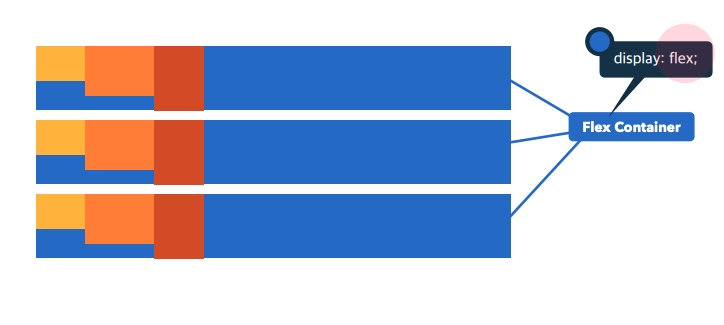
> - inline-flex는 item -> 수평정렬 + container -> inline으로 바꿔주어  
container가 수평으로 쌓이도록 한다
> 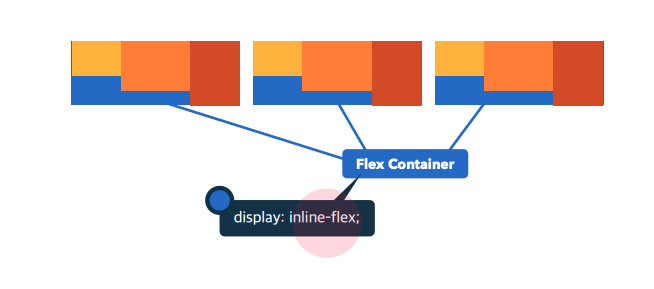

### 24.flex-direction
> 축(행, 열)을 설정  
> #### 값  
> - row(기본 값) : 좌->우 수평으로 쌓임  
> - row-reverse : 우->좌 수평으로 쌓임  
> - column : 열  
> - column-reverse  
>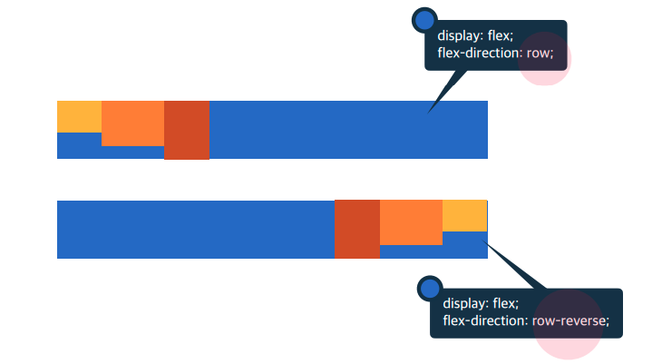

### 25.flex-wrap
> flex Items 묶음(줄 바꿈)여부
> #### 값
> - no wrap(기본 값) : 묶음(줄 바꿈)없음
> - wrap
>
>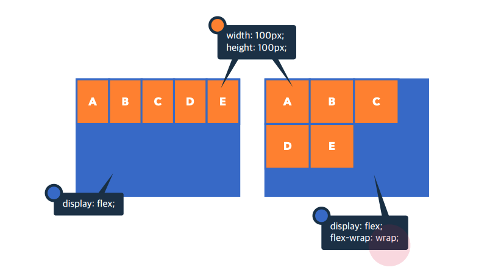

### 26.justify-content
> 주 축(수평)의 정렬 방법
> #### 값
> - flex-start(기본 값) : Flex Items를 시작점으로 정렬
> - flex-end : Flex Items를 끝점으로 정렬
> - center : Flex Items를 가운데 정렬
> - space-between
> - space-around
>
>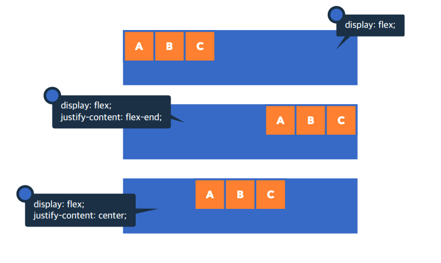

### 27. align-content
> 교차 축(수직)의 여러 줄에 대한 정렬 방법  
> 속성이 동작하려면 flex-wrap(=2줄의 items) + 정렬가능한 여백이 있어야함  
> #### 값
> - stretch(기본 값) : Flex Items를 시작점으로 정렬(띄워서)
> - flex-start : Flex Items를 시작점으로 정렬(붙여서)
> - flex-end
> - center
>
>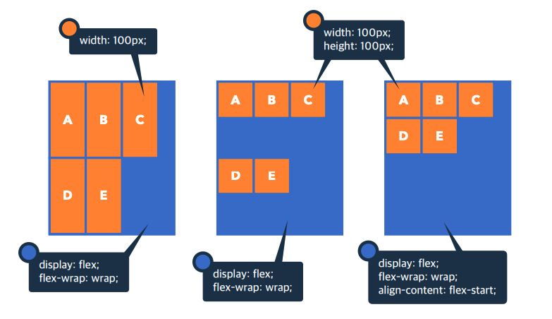

### 28. align-items
> 교차 축의 한 줄 한 줄에 대한 정렬 방법
> #### 값
> - stretch(기본 값) : Flex Items를 시작점으로 정렬(띄워서)
> - flex-start : Flex Items를 시작점으로 정렬(붙여서)
> - flex-end
> - center
>
>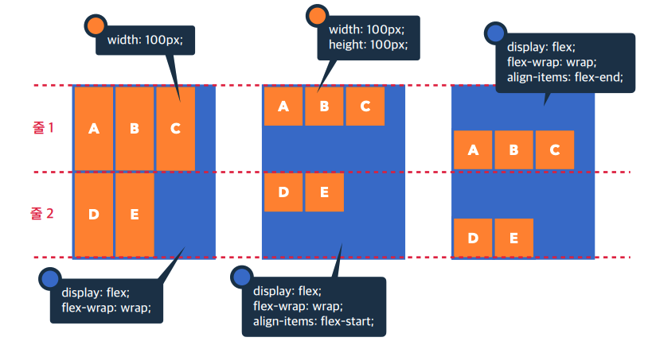

## flex Items에 적용하는 속성
### 29.order
> Flex Item의 순서 지정  
> 기본 값 : 0  
>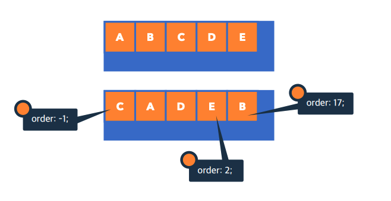

### 30. flex-basis
> Flex Item 공간 배분 전 기본 너비
> #### 값
>- auto(기본 값) : item Content 너비
>- px, em, rem
>
>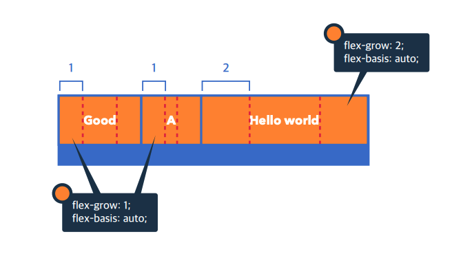
>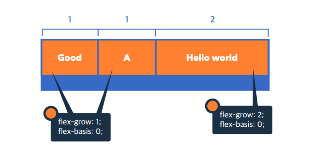
>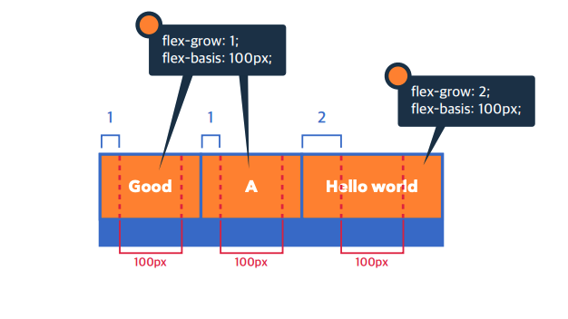

### 31.flex-grow
> Flex Item의 증가 너비 비율
> #### 값
> - 0(기본 값)  
> - 숫자(증가 비율) 
> #### 사용
> - flex-basis : 0과 함께 사용하면 편함
> - 다른 item비율을 0, flex-grow 값만큼 비율 적용되어 직관적으로 item비율들을 조정하기 쉬움
>
>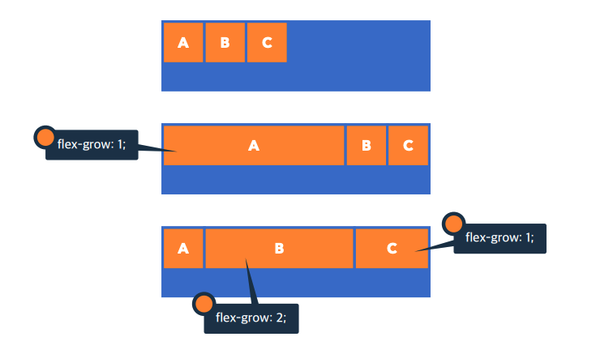

### 32.flex-shrink
> Flex Item의 감소 너비 비율
> #### 값
> - 1(기본 값) : 0이 아닌 이유는 컨테이너가 줄때 같이 줄기 때문
> - 숫자(감소 비율)
>#### 사용
>- 주로 container가 줄어도 Item은 안 줄어들게 하기 위해 flex-shrink : 0으로하여 사용
>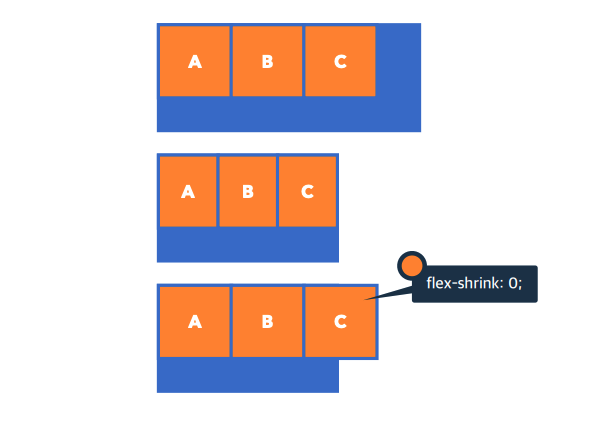
