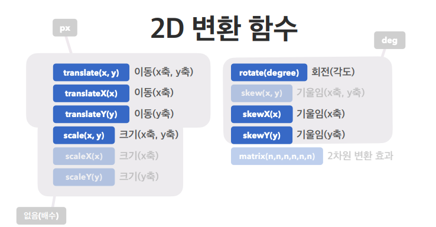
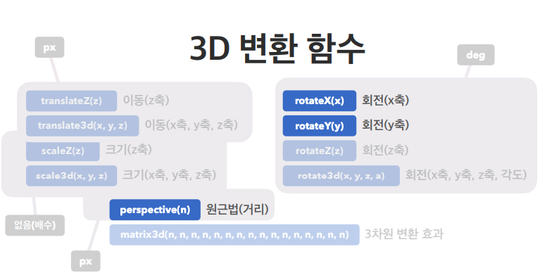
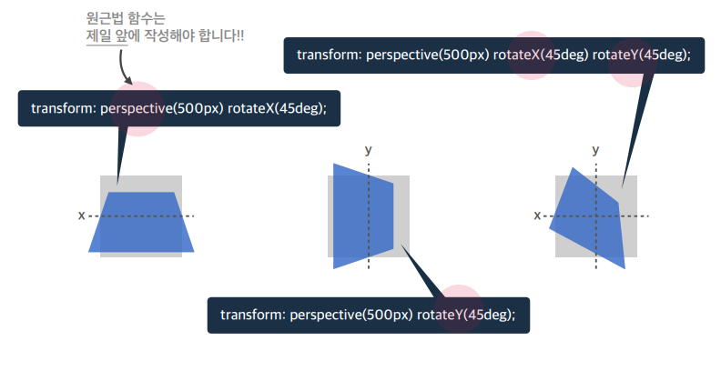
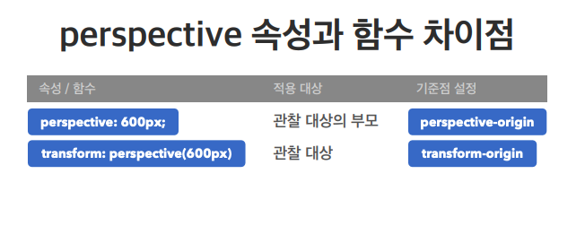
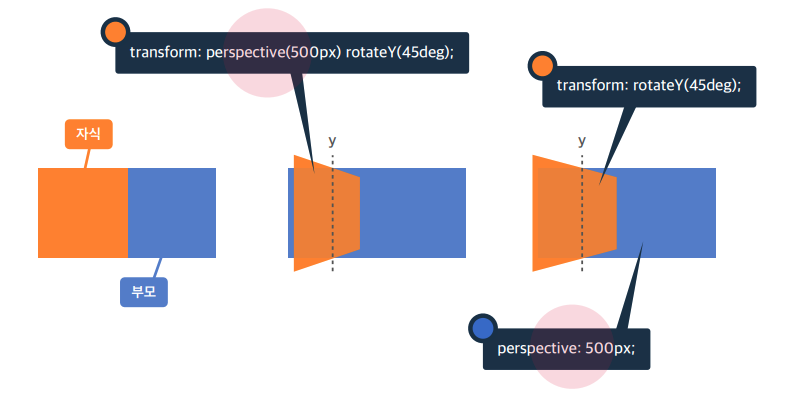
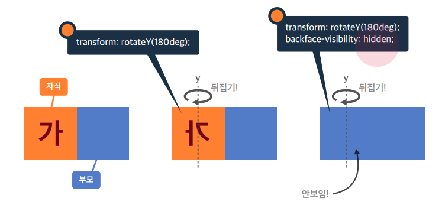

### 33.transition
> 요소의 전환(시작~끝)효과를 지정하는 단축 속성
>
>#### 단축 속성
>- transition-property(속성명)
>- trasition-duartion(지속시간) : 단축형 작성시 필수 속성
>- transition-timing-function(타이밍함수)
>- transition-delay(대기시간)

### 33-1.transition-property
>전환 효과를 사용할 속성 이름 지정
> #### 값
>- all(기본 값) : 모든 속성에 적용
>- 속성이름 : width, height ....

### 33-2.transition-duration
>전환 효과의 지속시간을 지정
> #### 값
>- 0s(기본 값)
>- Ns

### 33-3.transition-timing-function
>전환 효과의 타이밍(Easing)함수를 지정
>#### 값
>- ease(기본 값) : 느리게-빠르게-느리게
>- linear : 일정하게
>- ease-in : 느리게-빠르게
>- ease-out : 빠르게-느리게
>- ease-in-out : 느리게-빠르게-느리게
>
>#### Easing 함수 활용 사이트
>- <a href="https://easings.net/ko">easings.net</a>
>- <a href="https://developer.mozilla.org/en-US/docs/Web/CSS/easing-function">MDN</a>
>- <a href="https://greensock.com/docs/v2/Easing">tweenmax easing</a>

### 33-4.transition-delay
>전환 효과 시작 전 시간 지정
>#### 값
>- 0s(기본 값)
>- Ns

### 34.transform
>
>
>

### 34-1.perspective(속성)
> 하위 요소를 관찰하는 원근 거리를 지정
> 주로 속성을 더 자주 쓴다

### perspective 속성 vs perspective() 함수
>
>
>- 2번째 그림은 자식의 가운데를 기준으로 500px 원근 거리를 가지고 회전
>- 3번째 그림은 부모의 가운데를 기준으로 500px 원근 거리를 가지고 회전

### 35.backfface-visibility
>3D 변환으로 회전된 요소의 뒷면 숨김 여부
>#### 값
>visible(기본 값): 뒷면 보임
>hidden : 뒷면 숨김
>
>
