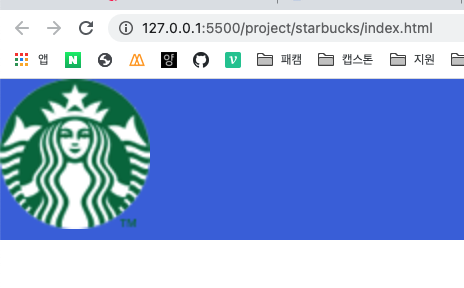
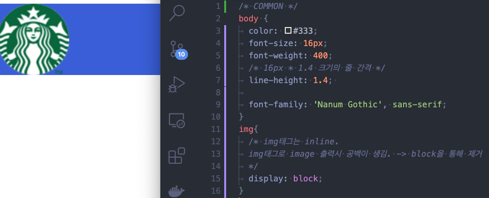
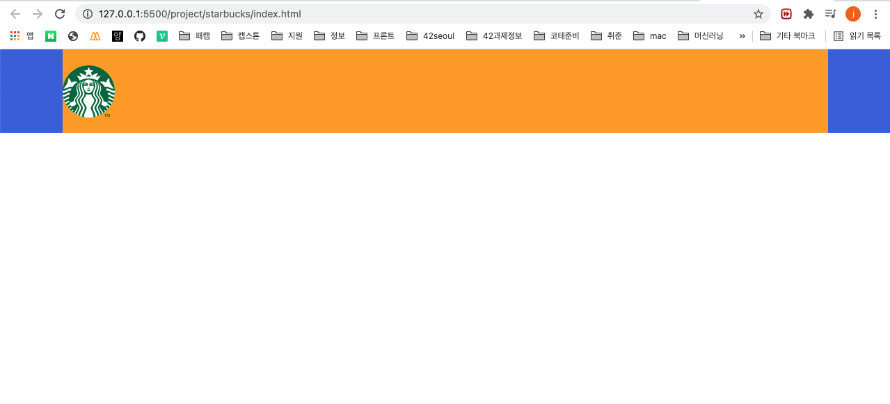
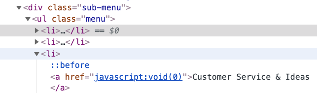

## img {display : block} 사용 이유
>
>


## 배치

```css
/* HEADER */
header {
	background-color: royalblue;
}

header .inner{
	/*1)inner 수평 중앙 배치*/
	width: 1100px;
	height: 120px;
	margin:0 auto;

	background-color: orange;
	position:relative;
}
header .logo{
	/*2) "부모 요소"를 기준으로 수직 가운데 배치(position) */
	height: 75px;
	position:absolute;
	top:0;
	bottom: 0;
	margin :auto 0;
	/*  */
	left:0;
	
	/*3)"부모 요소"를 기준으로 수평 중앙 배치 방법 */
	/* 
	width:
	left:0
	right:0
	margin:0 auto
	position:absolute;
	*/
}
```
>1)과 2)3)의 차이점
>- 기준(position : relative)의 유무
>- 2)3)은 부모가 보이려면(bg-color) 부모 요소도 width, height가 있어야함  
>  없으면 부모 크기 = 자식 크기 설정 => 자식(bg-color)만 보임.
>### 결론 
>- 1)은 가로 기준(block)에서 가운데에 배치  
>- 2)3)은 부모기준에서 가운데에 배치
   
## 가상요소 선택자
```css
header .sub-menu ul.menu li::before {
	content: "";
	display:block;
	/*display:block;  position:absolute로 block으로 바뀜*/
	width: 1px;
	height: 12px;
	background-color: #e5e5e5;
	position: absolute;
	top: 0;
	bottom: 0;
	margin: auto 0;
}
```


>- li태그 안의 요소(a태그) 전에(before) ""가 들어간다.  
>- 메뉴바 사이에 구분줄 만드는데 씀
>- li::befor의 부모는 li
